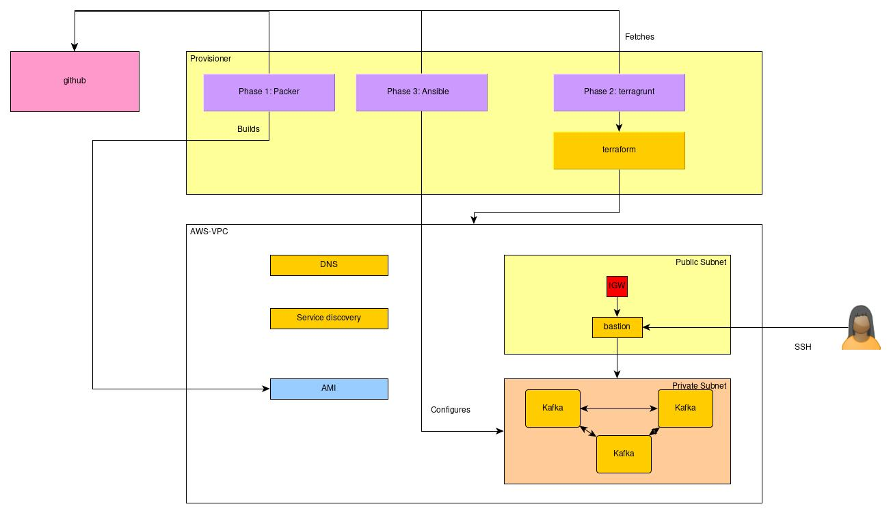

# Apache Kafka Cluster from scratch
This is loosely based on the git project `https://github.com/fscm/packer-aws-kafka` that was outdated and needed to be rewritten.   
This builds a cluster on AWS in three steps: 
- Creating the AIMs with kafka and zookeeper using packer.
- Creating the infrastructure on AWS using terragrunt / terraform.
- Configuring and starting the cluster using ansible. 

 This is a three stage project to create working kafka cluster.

# Layout of this readme
We start with a short description, then a TL;DR section for the impatient. Followed by details about the process, concluded by details about the 
zookeeper and kafka configuration tools used. 

# In short

## Technology stack
- Terraform 0.12.13
- Terragrunt 0.20.4
- Aws cli aws-cli/1.16.263 Python/3.7.4 Linux/5.3.7-arch1-1-ARCH botocore/1.12.253
- aws-vault v4.6.4
- packer 1.4.1
- Kafka 2.1.1
- Zookeeper 3.4.9
- Java 1.8.222
- ansible 2.8.5


## Synopsis
Create a working kafka cluster in three phases using terraform, ansible and packer. 

**Phase 1**  
This script will create an AMI with Apache Kafka installed and with all of
the required initialization scripts.  
Tools: packer, aws-vault.

**Phase 2**  
The AMI resulting from this script should be the one used to instantiate a
Kafka server (standalone or cluster).  
Tools : Terragrunt, Terraform, aws-vault
  
**Phase 3**  
The configuration for anything else than stand alone is done by ansible.  
Tools: Ansible  

# TL;DR

**Step Zero**  
You need: 
- An AWS account with key and secret key to accounts that allow you to create ec2, security groups, vpc, subnets, ssh keys etc. 
- An ssh key that you can pass to the aws stack
- ssh client installed 
- Preferable linux or mac, windows needs other actions I am not familiar with. 
- All tech stack applications installed.   

**Step One**  

Setup aws-vault with 
```
aws add home
```
Follow the instructions   

**Step Two**  

Now build kafka base image with (Replace values as needed) 
There are two types, kafka and zookeeper. 
For kafka
```
packer build \
    -var "aws_access_key=$AWS_ACCESS_KEY" \
    -var "aws_secret_key=$AWS_SECRET_KEY" \
    -var 'aws_region=ap-southeast-2' \
    -var 'kafka_version=2.1.1' \
    -var "aws_public_key=$SSH_PUBLIC_KEY_STRING" \
    kafka.json
 
```
For zookeeper
```
packer build \
    -var "aws_access_key=$AWS_ACCESS_KEY" \
    -var "aws_secret_key=$AWS_SECRET_KEY" \
    -var 'aws_region=ap-southeast-2' \
    -var "aws_public_key=$SSH_PUBLIC_KEY_STRING" \
    zookeeper.json
 
```
Grab the ami ids for both and pass through to terragrunt phase later on.

**Step Three**

```
cd terragrunt
terragrunt plan -var "base_kafka_image_ami=<theoneyougrabbed_kafka>" -var "base_zookeeper_image_ami=<theoneyougrabbed_zookeeper>"
terragrunt apply
cd ..
```
Grab the bastion ip address that terraform gives you on successful completion. 
and place it in `ansible/ssh.cfg` if that does not work place it in `~/.ssh/config`. 

-OR-

Use it as a module: see `test\kafka-cluster-module-test.tf` how to use it as a module.

**Step Four**

Then run 
```
cd ansible
. ./prime-ssh-connection.sh
bash apply-configuration
```

**Step Five**

Profit!


# More details? let's go!

## What are we building 



## Getting Started

There are a couple of things needed for the script to work.

### Prerequisites

Packer, Terraform, Terragrunt, and the AWS Command Line Interface tools need to be installed on your local
computer with a profile configured to connect to aws. 
As an convenience you can install aws-vault to inject the AWS vars in your session. Your call.   
You also need to decide in which region you want to build the stack as you need your packer AMI there as well. 

#### Packer
_Phase 1_  
Packer installation instructions can be found
[here](https://www.packer.io/docs/installation.html).

We start with building the packer image, or take the one that is already there. Look for a name like: 
`kafka-2.1.1-(20190527012503)` and take the AMI ID and past that into the variable file (terraform/vars.tf)
See below
> Note: Do not forget to clear out old AMI images as they draw a small cost for something you are not likely to use again. 


#### AWS Command Line Interface

AWS Command Line Interface installation instructions can be found [here](http://docs.aws.amazon.com/cli/latest/userguide/installing.html)
AWS-vault can be installed from [here](https://github.com/99designs/aws-vault)

#### Ubuntu AMI's for Packer

This AMI will be based on an official Ubuntu AMI (18.04.1). The latest version of that
AMI will be used.

A list of all the Ubuntu AMI id's can be found at the Ubunu official page:
[Ubuntu 18.04 official Amazon EC2 Images](https://cloud-images.ubuntu.com/locator/ec2/)
I am an Ubuntu fan but there is nothing stopping you using different distros, you may need to change the ansible scripts especially if you move to CentOS and alike. Have fun!      

### Usage

In order to create the AMI using this packer template you need to provide a
few options.
Set the two environment vars to have the aws access and secret keys (And do not submit these to git, duh)
Also replace the AWS_REGION by the AWS [region](https://docs.aws.amazon.com/general/latest/gr/rande.html) you want to deploy to.
and set the SSH_PUBLIC_KEY_STRING  
```
Usage:
packer build \
    -var "aws_access_key=$AWS_ACCESS_KEY" \
    -var "aws_secret_key=$AWS_SECRET_KEY" \
    -var 'aws_region=ap-southeast-2' \
    -var 'kafka_version=2.1.1' \
    -var "aws_public_key=$SSH_PUBLIC_KEY_STRING" \
    kafka.json
  
```
Or with aws-vault: 
```
 aws-vault exec home -- packer build -var "aws_access_key=$AWS_ACCESS_KEY" -var "aws_secret_key=$AWS_SECRET_KEY" -var 'aws_region=ap-southeast-2' -var 'kafka_version=2.1.1' -var "aws_public_key=$SSH_PUBLIC_KEY_STRING" kafka.json
```
In this case you do not need to set the AWS env it is set for this call only and then removed. 

#### Script Options

- `aws_access_key` - *[required]* The AWS access key.
- `aws_ami_name` - The AMI name (default value: "kafka").
- `aws_ami_name_prefix` - Prefix for the AMI name (default value: "").
- `aws_instance_type` - The instance type to use for the build (default value: "t2.micro"). Note this is for the build of the image, not the running instance itself as that will be selected in the terraform phase.  
- `aws_region` - *[required]* The regions were the build will be performed.
- `aws_secret_key` - *[required]* The AWS secret key.
- `aws_ssh_username` - The ssh user that is set up by the script, defaults to `admin`
- `java_build_number` - Java build number (default value: "11").
- `java_major_version` - Java major version (default value: "8").
- `java_token` - Java link token (default version: "d54c1d3a095b4ff2b6607d096fa80163").
- `java_update_version` - Java update version (default value: "131").
- `kafka_scala_version` - Kafka Scala version (default value: "2.11").
- `kafka_version` - *[required]* Kafka version.
- `system_locale` - Locale for the system (default value: "en_US").
- `zookeeper_version` - Zookeeper version (default value: "3.4.9").


#### Terraform 

_Phase 2_  
This is just for testing, use terragrunt or the terraform module for actually using it. 
You need to create or change the .aws/credentials file to be able to run against your aws account. Adapt it in the provider.tf files.  
Then run from the terraform folder, put in the vars section the name of the image just build. 
For instance: 

```bash
export SSH_PUBLIC_KEY_STRING=<yourkey>
terraform plan -var 'base_kafka_image_aim=ami-05aa27f98e8b3c6b8' -var 'base_zookeeper_image_aim=ami-06aa27f98e8b3c6b8' -var "aws_public_key=$SSH_PUBLIC_KEY_STRING" -out kafka.plan
``` 
Note that if you want to interpolate the bash variables you need to use double quotes around the values, not single quotes as otherwise this will take the literal string and not
the value in it. 

You need not do this when using `aws-vault`

Then apply it by 
```bash
terraform apply kafka.plan
```

You also need to create a terragrunt/secrets.tfvars.json file with the ssh key you use to get to the kafka instance.
This is then injected by terragrunt but you can use it with terraform plan as well (See [below]("# Terraform-module")).  
```json
{
  "aws_public_key": <yourkeyhere>
}
```

or 

```bash
aws_public_key = "YOUR PUBLIC KEY HERE"
```


The "secret*" pattern is excluded from git so it will not be pushed into git. 


Now use the `packer build kafka.json` script with packer to create the kafka image to use, this can be done by adding it to the commandline as before or set it in the 
default of the variable in the var.tf file. The script returns a ami id and you need to place 
this into the vars.tf file.
For instance 
```hcl-terraform
variable "base_kafka_image_aim" {
  type = "string"
  default = "ami-03fd73a66cf574a36"
}
```
Or pass it in as a var `-var 'base_kafka_image_aim=ami-03fd73a66cf574a36'`
After the terraform apply we have three servers, one with a public ip to be able to set up the cluster, and then two other brokers running on the same machine / base image. 

#### Terragrunt 
*Preferred way of building*  

In the terragrunt folder are the terragrunt scripts. The commands are likewise but will build the infra from the 
git tag helping versioning. 
This will use the terraform script as a terraform module. See [here](https://blog.gruntwork.io/how-to-create-reusable-infrastructure-with-terraform-modules-25526d65f73d)

You need to create a secrets.json file that cannot be stored in git. In this case it will hold the 
public ssh key injected in the public kafka broker. 

```json
{
  "aws_public_key": "your-public-key-here"
}

```
You now run 
```bash
# Run once 
terragrunt init
# Plan the same as in terraform
terragrunt plan
# Now apply 
terragrunt apply -var-file secrets.json  

```
or include this in the terragrunt.hcl file: 
```hcl-terraform
  # With the get_terragrunt_dir() function, you can use relative paths!
    arguments = [
      "-var-file=secrets.json"
    ]
```
Note the explicit var-file reference in the apply to avoid storing secrets in your planfile. 

inputs / vars 

| var name | default | type | meaning |
| --- | --- | --- | --- |
| base_kafka_image_ami | "" | String | Base kafka AMI (build by packer) |
| base_zookeeper_image_ami | "" | String | Base zookeeper AMI (build by packer) |
|   region | "ap-southeast-2"| String | AWS region you want to deploy to |
 |  build_bastion | true| boolean | Build a bastion to connect to, needed for ansible |
 |  kafka_cluster_size | 3| Number | number of kafka instances |
 |  zookeeper_cluster_size | 3| Number | number of zookeeper instances |
 |  kafka_instance_type | "m4.large"| String | AWS instance type, needs to be available in all azs you choose later |
 |  zookeeper_instance_type | "m4.large"| String | AWS instance type, needs to be available in all azs you choose later |
 |  kafka_exp_tags | {<br>     Author= "Philip Rodrigues"<br>     State= "Experimental"<br>     Department= "CloudOps"<br>     Description= "Experimental_kafka_cluster_instance"<br>  } | map | Tag set for all resources supporting tags | 
 |  zookeeper_exp_tags | {<br>     Author= "Philip Rodrigues"<br>     State= "Experimental"<br>     Department= "CloudOps"<br>     Description= "Experimental_zookeeper_cluster_instance"<br>  } | map | Tag set for all resources supporting tags |
 |  ip_allow_access_ip4|"111.69.150.132/32" | String - cidr |IPv4 address that is allowed to connect to the bastion from the BBI
 |  ip_allow_access_ip6|""| String - cidr |IPv6 address that is allowed to connect to the bastion from the BBI (Not implemented yet|
 |  azs | ["ap-southeast-2a",<br>    "ap-southeast-2b",<br>   "ap-southeast-2c"]<br>| list of String | List of availability zones to run the brokers in, needs to be in the region | 
 |  vpc_cidr | "10.201.0.0/16" | String - cidr | Main range for the VPC | 
 |  azs_subnets_private | { <br>    "ap-southeast-2a"= "10.201.1."<br>    "ap-southeast-2b"= "10.201.2."<br>    "ap-southeast-2c"= "10.201.3."<br>  } | map | Defines ip ranges per AZ for the private broker subnet, needs to fit in the VPC selection above , is aways a /24 range|
 |  azs_subnets_public | { <br>    "ap-southeast-2a"= "10.201.101."<br>    "ap-southeast-2b"= "10.201.102."<br>    "ap-southeast-2c"= "10.201.103."}<br> | map | Defines ip ranges per AZ for the public access, needs to fit in the VPC selection above , is aways a /24 range|
 |  kafka_cluster_name | "MyKafkaSet"| String | Name to give to the cluster will be appended with a 0 based index|


#### Result 
We now have three kafka servers with a dynamic IP address 
These instances are not in cluster and do not find each other. We will remedy this in phase 3


# Post configuration with ansible
_Phase 3_  
To make the process scalable we do not always know the exact ip address so we use ansible as a post deployment tool. This will set up zookeeper and then restart the services to run the application.  
Note: You need to jump host to run this.  
Note: Though you can call ansible from terraform, i prefer to have separation of concern and leave terraform as an infrastructure provision phase only and ansible as configuration phase. 


First configure ssh and ansible to use the jumphost in the ansible/ssh.cfg file.

```
Host 10.201.*
    User admin
    ProxyCommand ssh -W %h:%p jumphost 
    IdentityFile ~/.ssh/id_rsa_kafka
    

Host jumphost
    HostName 13.238.72.96
    User ubuntu
    IdentityFile ~/.ssh/id_rsa_kafka
    Compression  yes
    ForwardAgent yes
    ControlMaster              auto
    ControlPersist             10m

```

> TODO: Seems not to be picked up by ansible, for now change this in the config in ~/.ssh/config  

Where you need to change the `HostName 13.238.72.96` with the correct IP address as that may change. Terraform will print that address on completion of the apply.   
Also add the key to the agent

**What does this do?**

It will define the jumphost so you can use `ssh jumphost` to get on the bastion. (bastion and jumphost are used interchangeable)   it will use the ssh key and forward the key. 
Now you also define that all ssh login starting with 10.201 will be routed through the jumphost. You may notice that the packer script created the admin user. 

To prime the ssh connection you run this 
```
eval "$(ssh-agent -s)"
ssh-add ~/.ssh/id_rsa_kafka
```
To make life easy this is in the prime-ssh-connection.sh script. 

Now run the 
```
 . ./prime-ssh-connection.sh 
``` 
to prime the ssh keys, in this file set the private key to use. You need the extra period in the front to export the env settings. 

Now configure the kafka / zookeepers by running 
```bash
cd ansible
bash ./apply-configuration.sh
```
That should take care of the kafka cluster setup. 

## What does this do? 
 It runs the ansible playbook configure_zookeeper_playbook.yml with configuration from the hosts file. 
 ```
 aws-vault exec home -- ansible-playbook -i hosts configure_zookeepers_playbook.yml
 ```
It creates the kafka commands on each broker(See below): 
```
sudo zookeeper_config -E -S -i {{ broker_id }} -m {{zookeeper_memory}}m -n {{zookeepers_sequence}}
sudo kafka_config -a {{local_address}} -E -i {{ broker_id }} -m {{kafka_mem}}m -S -z {{kafka_zoo}}
```
And then executes them thereby setting up the cluster. 


# Details configuration kafka and zookeeper
### Instantiate a Cluster


#### Description of the tools that ansible will call. 
In order to end up with a functional Kafka Cluster some configurations have to
be performed after instantiating the servers.

To help perform those configurations a small script is included on the AWS
image. The script is called **kafka_config**.

A Zookeeper instance or cluster (for production environments) is required to
instantiate a Kafka cluster.

If required, a Zookeeper server/node can be started within this image (see
below for more information) however, for production environments, it is
recommended to use a dedicated and separated Zookeeper instance or cluster.

#### Kafka Configuration Script

The script can and should be used to set some of the Kafka options as well as
setting the Kafka service to start at boot.

```
Usage: kafka_config [options]
```

##### Options

* `-a <ADDRESS>` - Sets the Kafka broker advertised address (default value is 'localhost').
* `-D` - Disables the Kafka service from start at boot time.
* `-E` - Enables the Kafka service to start at boot time.
* `-i <ID>` - Sets the Kafka broker ID (default value is '0').
* `-m <MEMORY>` - Sets Kafka maximum heap size. Values should be provided following the same Java heap nomenclature.
* `-S` - Starts the Kafka service after performing the required configurations (if any given).
* `-W <SECONDS>` - Waits the specified amount of seconds before starting the Kafka service (default value is '0').
* `-z <ENDPOINT>` - Sets a Zookeeper server endpoint to be used by the Kafka broker (defaut value is 'localhost:2181'). Several Zookeeper endpoints can be set by either using extra `-z` options or if separated with a comma on the same `-z` option.


[Configuration Script](#kafka-configuration-script) section for more details

We configure and run the kafka and zookeepers from the user_data script in the terraform script. 
Check the `template.tf` and the `instances.tf` scripts. For documentation we show what we actually run on the 
servers on deployment complete: 

Now how do we know the ip addresses and the broker ids? Since we do not know this till terraform has been completed. 
Terraform AFAIK does not have post deployment tasks, so we need to run this after terraform has been completed.  
Entering ansible. 
 


#### Instantiate Zookeeper

Is it possible to use the included Zookeeper installation to instantiate a
Zookeeper node (standalone or as part of a cluster).

In order to end up with a functional Zookeeper node some configurations have to
be performed after instantiating the servers.

To help perform those configurations a small script is included on the AWS
image. The script is called **zookeeper_config**.

##### Zookeeper Configuration Script

The script can and should be used to set some of the Zookeeper options as well
as setting the Zookeeper service to start at boot.

```
Usage: zookeeper_config [options]
```

##### Options

* `-D` - Disables the Zookeeper service from start at boot time.
* `-E` - Enables the Zookeeper service to start at boot time.
* `-i <ID>` - Sets the Zookeeper broker ID (default value is '1').
* `-m <MEMORY>` - Sets Zookeeper maximum heap size. Values should be provided following the same Java heap nomenclature.
* `-n <ID:ADDRESS>` - The ID and Address of a cluster node (e.g.: '1:127.0.0.1'). Should be used to set all the Zookeeper nodes. Several Zookeeper nodes can be set by either using extra `-n` options or if separated with a comma on the same `-n` option.
* `-S` - Starts the Zookeeper service after performing the required configurations (if any given).
* `-W <SECONDS>` - Waits the specified amount of seconds before starting the Zookeeper service (default value is '0').

First start: 
```bash
sudo su
zookeeper_config -E -i 1 -m 512m -n 1:10.201.1.140
```

#### Configuring a Zookeeper Node

To prepare an instance to act as a Zookeeper node the following steps need to
be performed.

Run the configuration tool (*zookeeper_config*) to configure the instance.

```
zookeeper_config -E -S
```

After this steps a Zookeeper node (for a standalone setup) should be running
and configured to start on server boot.

For a cluster with more than one Zookeeper node other options have to be
configured on each instance using the same configuration tool
(*zookeeper_config*).

```
zookeeper_config -E -i 1 -n 1:zookeeper01.mydomain.tld -n 2:zookeeper02.mydomain.tld,3:zookeeper03.mydomain.tld -S
```

After this steps, the first node of the Zookeeper cluster (for a three node
cluster) should be running and configured to start on server boot.

More options can be used on the instance configuration, see the
[Configuration Script](#zookeeper-configuration-script) section for more details

## Services

This AMI will have the SSH service running as well as the Kafka services. The
Zookeeper service may also be running on this AMI.
The following ports will have to be configured on Security Groups.

| Service      | Port      | Protocol |
|--------------|:---------:|:--------:|
| SSH          | 22        |    TCP   |
| Zookeeper    | 2181      |    TCP   |
| Zookeeper    | 2888:3888 |    TCP   |
| Kafka Broker | 9092      |    TCP   |

After the theory now how we are setting these tools to be triggered by ansible. 

# Terraform-module
This can be used as a kafka module , see the example in the test folder.
Note that you need to pass the secret key as a var here as you do not use the secrets file.
You can use the env var by setting it in 
```
export KEY=<your ssh key>
terraform plan -var "aws_public_key=$KEY" -out kafka.plan
```
Or pass it as a configuration file. 
```
terraform plan -var-file ../terragrunt/secrets.tfvars.json -out kafka.plan
```
Note that you need to redeclare the aws_public_key and then pass it on through in the params (You need not do that in terragrunt)
In the module declaration  add: 
```
variable "aws_public_key" {

}
```

And in the module for example in the test module file `test/kafka-cluster-module-test.tf` add:
```
aws_public_key = var.aws_public_key
```
To pass the value from the secrets.tfvars.json on. It is an abstraction that is pretty vague and not well documented. It kind of follows from the way terraform works. And it only makes sense when you get deeper into terraform. 


# Wrapping up 
## Authors

* **Frederico Martins** - [fscm](https://github.com/fscm) - Initial project - it was forked and adapted for use 
* **Philip Rodrigues** - [phiro](https://github.com/phiroict)  - Expansion, scalability, terragrunt/terraform/ansible modules and upgrades 

See also the list of [contributors](https://github.com/fscm/packer-aws-kafka/contributors)
who participated in this project.


## This project

### License

This project is licensed under the MIT License - see the [LICENSE](LICENSE)
file for details

## Contributing

1. Fork it!
2. Create your feature branch: `git checkout -b my-new-feature`
3. Commit your changes: `git commit -am 'Add some feature'`
4. Push to the branch: `git push origin my-new-feature`
5. Submit a pull request

Please read the [CONTRIBUTING.md](CONTRIBUTING.md) file for more details on how
to contribute to this project.

## Versioning

This project uses [SemVer](http://semver.org/) for versioning. For the versions
available, see the [tags on this repository](https://github.com/phiroict/kafka-packer-terraform-aws/tags).